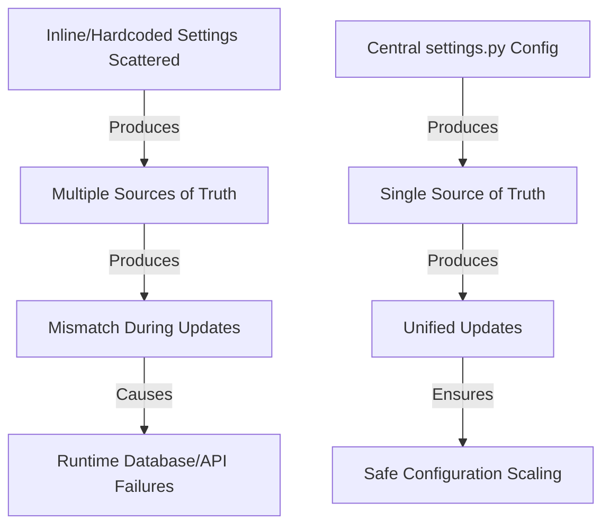

# Hardcoded Variables Review

Moving inline variables to `settings.py` establishes a single source of truth. When configuration details are scattered, editing a value in one file while forgetting another causes mismatched settings, leading to runtime failures.

Here is the list of inline variables discovered across the codebase and how they can be centralized.

---

## 1. RAG & Embedding Configurations
Having duplicate constants in different files makes updates error-prone.

| Current File | Inline Variable & Code | Suggested setting in `settings.py` |
| :--- | :--- | :--- |
| [ingestion.py](file:///Users/apple/project/TopicTrace/src/topictrace/rag/documentIngestion/ingestion.py#L28-L29) | `_INDEX_NAME = "chunk_vector_index"` `_EMBEDDING_DIM = 768` | `NEO4J_INDEX_NAME = "chunk_vector_index"` `EMBEDDING_DIM = 768` |
| [nodes.py](file:///Users/apple/project/TopicTrace/src/topictrace/rag/documentRetrieve/graph/nodes.py#L32) | `_CHUNK_VECTOR_INDEX = "chunk_vector_index"` | Replaces local constant with `settings.NEO4J_INDEX_NAME` |
| [ingestion.py](file:///Users/apple/project/TopicTrace/src/topictrace/rag/documentIngestion/ingestion.py#L49-L51) | `base_url="https://api.jina.ai/v1/embeddings"` `embeddingModel="jina-embeddings-v2-base-en"` `max_concurrency=10` | Uses `settings.EMBEDDING_CONFIG.JINA_BASE_URL` etc. directly |
| [embeddingModelProvider.py](file:///Users/apple/project/TopicTrace/src/topictrace/provider/embeddingModelProvider.py#L26) | `"task": "retrieval.query"` | `JINA_EMBEDDING_TASK = "retrieval.query"` |

---

## 2. Entity Resolution Thresholds
Changing entity-matching sensitivity requires tuning. Inline numbers force you to search through files to tweak them.

| Current File | Inline Variable & Code | Suggested setting in `settings.py` |
| :--- | :--- | :--- |
| [entityResolution.py](file:///Users/apple/project/TopicTrace/src/topictrace/rag/documentIngestion/entityResolution.py#L24) | `threshold: int = 88` (fuzzy match ratio) | `ENTITY_RESOLUTION_FUZZY_THRESHOLD = 88` |
| [entityResolution.py](file:///Users/apple/project/TopicTrace/src/topictrace/rag/documentIngestion/entityResolution.py#L36-L37) | `high_threshold: float = 0.90` `low_threshold: float = 0.50` | `ENTITY_RESOLUTION_HIGH_THRESHOLD = 0.90` `ENTITY_RESOLUTION_LOW_THRESHOLD = 0.50` |
| [ingestion.py](file:///Users/apple/project/TopicTrace/src/topictrace/rag/documentIngestion/ingestion.py#L131) | `0.75` default score in candidates list comprehension | `ENTITY_RESOLUTION_DEFAULT_CANDIDATE_SCORE = 0.75` |

---

## 3. Contextual Retrieval & LLM Generation Parameters
Concurrencies and limits affect performance and api costs.

| Current File | Inline Variable & Code | Suggested setting in `settings.py` |
| :--- | :--- | :--- |
| [contextual_retrieval.py](file:///Users/apple/project/TopicTrace/src/topictrace/rag/documentIngestion/contextual_retrieval.py#L53) | `max_tokens: int = 120` | `CONTEXTUAL_RETRIEVAL_MAX_TOKENS = 120` |
| [contextual_retrieval.py](file:///Users/apple/project/TopicTrace/src/topictrace/rag/documentIngestion/contextual_retrieval.py#L80) | `max_concurrency = 10` | `CONTEXTUAL_RETRIEVAL_MAX_CONCURRENCY = 10` |
| [llm.py](file:///Users/apple/project/TopicTrace/src/topictrace/provider/llm.py#L26-L27) | `timeout=60` | `LLM_CLIENT_TIMEOUT_SECONDS = 60` |

---

## The Cause-and-Effect Flow

